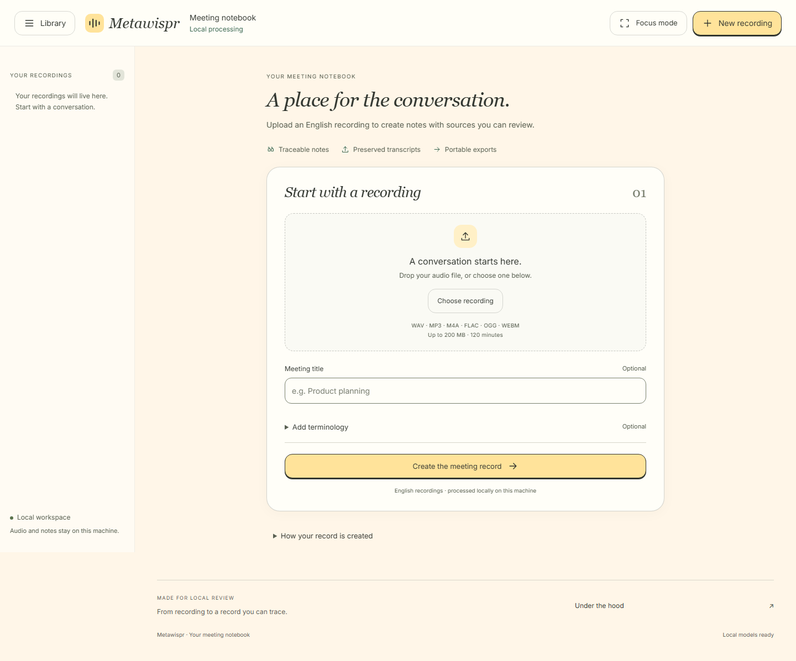
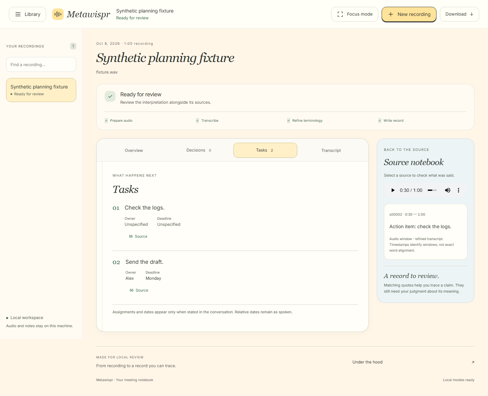
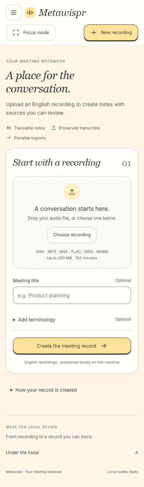

<p align="center">
  
</p>

<h1 align="center">Metawispr</h1>
<p align="center"><strong>Your conversations, turned into a meeting notebook.</strong></p>
<p align="center">Local audio processing · Traceable notes · Reviewable decisions and tasks</p>
<p align="center">
  <a href="#installation">Installation</a> ·
  <a href="#screenshots">Screenshots</a> ·
  <a href="docs/DESIGN.md">Architecture</a> ·
  <a href="docs/PHASE5.md">Evaluation</a>
</p>

## What it does

Metawispr turns **uploaded English audio recordings** into a meeting record you can read, review and export. Upload a recording, optionally add a title and terminology glossary, and follow its progress through the local pipeline.

- **Understand the conversation:** concise summaries and topic minutes.
- **Find what was agreed:** decisions and tasks, with owners and deadlines only when stated.
- **Check the source:** supporting quotes linked to playable audio windows.
- **Compare transcripts:** preserved raw recognition, refined text and accepted/rejected correction history.
- **Recover from failures:** saved checkpoints and explicit retries; a validated summary can remain available when tasks or decisions are unavailable.
- **Take your record with you:** Markdown, JSON, text transcripts and a ZIP bundle generated from the saved validated artifacts.

The responsive notebook includes a searchable recording library, keyboard navigation, focus mode and accessible motion preferences. Processing uses local models; **no hosted LLM API key is required**.

**Current status:** a working prototype with an implemented recording/review workflow. Meeting accuracy remains under evaluation. Source matching and validation help review model output; they do not guarantee correct interpretation.

## Tech stack

| Layer | Technology | Purpose |
| --- | --- | --- |
| Workspace | React, TypeScript, Vite, ordinary CSS | Responsive meeting notebook |
| Local API | Python, FastAPI, Uvicorn | Uploads, processing status, playback and exports |
| Audio preparation | FFmpeg / imageio-ffmpeg, NumPy | Decode and normalize recordings |
| Audio enhancement | GTCRN ONNX | Enhance audio before transcription |
| Speech recognition | Parakeet TDT 0.6B v2, INT8 ONNX, sherpa-onnx | Generate the raw transcript |
| Language processing | Qwen3.5 4B through Ollama | Terminology refinement and meeting documentation |
| Validation | Pydantic and evidence checks | Validate schemas, references and supporting quotes |
| Storage | Local files and JSON checkpoints | Preserve artifacts and resume completed stages |
| Verification | Python unittest, Playwright, axe | Backend behavior, browser flows and accessibility |

```text
Recording → Prepare + GTCRN → Parakeet INT8 → Raw transcript
         → Qwen terminology refinement → Qwen meeting documentation
         → Validation → Review + exports
```

One Qwen model installation serves **two distinct, sequential stages**, each with its own prompts, validation and checkpoints. Model weights are downloaded separately and are **not included in this repository**.

## Installation

### Prerequisites

- Git, Python **3.11–3.13** and [uv](https://docs.astral.sh/uv/getting-started/installation/).
- Node.js **22.12 or newer** and npm.
- [Ollama](https://ollama.com/download), running locally with support for `qwen3.5:4b`.
- Internet access for the initial dependency and model downloads.
- For GPU transcription: an NVIDIA GPU, a compatible CUDA-enabled sherpa-onnx wheel, and its matching CUDA/cuDNN runtime libraries.

GPU use is the default transcription profile. CPU transcription is also supported, but runtime depends on your hardware and recording. We have not established a universal minimum RAM/VRAM requirement; model files, runtime libraries and context memory are separate costs.

### 1. Clone and install dependencies

```sh
git clone https://github.com/mynkz3/metawispr.git
cd metawispr
uv sync --locked
cd frontend
npm ci
npm run build
cd ..
```

### 2. Download the models

Install Parakeet and the shared Qwen model:

```sh
uv run python -m metawispr download-model
ollama pull qwen3.5:4b
```

GTCRN is enabled by default and needs its own small ONNX file. Download
[gtcrn_simple.onnx](https://github.com/k2-fsa/sherpa-onnx/releases/download/speech-enhancement-models/gtcrn_simple.onnx)
and save it at **`models/gtcrn/gtcrn_simple.onnx`**.

On Windows PowerShell:

```powershell
New-Item -ItemType Directory -Force models/gtcrn | Out-Null
curl.exe -fL https://github.com/k2-fsa/sherpa-onnx/releases/download/speech-enhancement-models/gtcrn_simple.onnx -o models/gtcrn/gtcrn_simple.onnx
```

On Linux/macOS:

```sh
mkdir -p models/gtcrn
curl -fL https://github.com/k2-fsa/sherpa-onnx/releases/download/speech-enhancement-models/gtcrn_simple.onnx -o models/gtcrn/gtcrn_simple.onnx
```

### 3. Select your transcription runtime

The locked dependency install supplies the CPU package. For GPU transcription, install a compatible GPU wheel **after** `uv sync`.

<details>
<summary><strong>Windows GPU setup — Python 3.12, CUDA 12 and cuDNN 9</strong></summary>

Use a Python 3.12 environment for this example (`uv sync --locked --python 3.12` when creating it). Install the matching wheel:

```powershell
uv pip install --reinstall --no-deps --no-index --find-links https://k2-fsa.github.io/sherpa/onnx/cuda.html "sherpa-onnx==1.13.8+cuda12.cudnn9"
$env:METAWISPR_ASR_PROVIDER = 'cuda'
```

Install the wheel's required CUDA 12/cuDNN 9 libraries and ensure their library directories are accessible to the process. Follow the [official Windows CUDA instructions](https://k2-fsa.github.io/sherpa/onnx/install/windows/build-cuda.html). Installing a wheel alone does not install every NVIDIA runtime dependency.

For another operating system, Python version or CUDA runtime, choose the matching package from the [official sherpa-onnx wheel index](https://k2-fsa.github.io/sherpa/onnx/cuda.html) and [Python installation guide](https://k2-fsa.github.io/sherpa/onnx/python/install.html). Keep its sherpa-onnx base version aligned with this project's `1.13.8` pin.

</details>

<details>
<summary><strong>CPU transcription setup</strong></summary>

Keep the package installed by `uv sync` and set the provider in the terminal that starts the server.

Windows PowerShell:

```powershell
$env:METAWISPR_ASR_PROVIDER = 'cpu'
```

Linux/macOS:

```sh
export METAWISPR_ASR_PROVIDER=cpu
```

This selects Parakeet's provider. Ollama manages Qwen's own CPU/GPU placement independently. CPU execution can be slower; no fixed meeting-processing time is promised.

</details>

After manually installing a GPU wheel, use **`uv run --no-sync`** as shown below. A later `uv sync` may restore the locked CPU package, requiring the GPU wheel to be reinstalled.

### 4. Start and check the app

Ensure Ollama is running. If its desktop service is not already running, start it in a separate terminal:

```sh
ollama serve
```

From the repository root, in the terminal with your provider settings:

```sh
uv run --no-sync python -m metawispr doctor
uv run --no-sync uvicorn metawispr.api:app --host 127.0.0.1 --port 8000 --workers 1
```

Open **[http://127.0.0.1:8000](http://127.0.0.1:8000)**. Interactive API documentation is available at **`/docs`**. Resolve any readiness failures reported by `doctor` before processing.

Use one server process. Do not run CLI inference against the same data directory while the server is processing. Initial downloads require internet; the default inference pipeline does not depend on hosted model APIs.

## Screenshots

These are captures of the implemented notebook, not design mockups. The review screenshot uses **explicit synthetic UI fixture content** to demonstrate sources and missing assignments; it is not a model-quality result. No private recordings are included.

### Upload workspace



### Meeting review and source audio



### Mobile notebook



## Using Metawispr

1. Choose or drop an English recording: **WAV, MP3, M4A, FLAC, OGG or WEBM**. Default limits are **200 MiB and 120 minutes**; the interface displays configured limits.
2. Optionally give it a title and add glossary terms, one per line. Aliases use `alias => canonical`.
3. Create the record and follow **Prepare audio → Transcribe → Refine terminology → Write record**.
4. Review Overview, Decisions, Tasks and Transcript. Select a source to read its exact quote and seek the corresponding audio window.
5. Download the available artifacts or retry a failed stage from its saved progress.

Timestamps identify **audio windows, not exact word alignment**. Missing owners and deadlines remain **Unspecified**. Unavailable sections are labeled as unavailable, rather than implying nothing was stated. Raw transcripts remain accessible after downstream failures.

### Command line

```sh
uv run --no-sync python -m metawispr process /path/to/meeting.mp3 --title "Project planning" --glossary "Docker"
uv run --no-sync python -m metawispr transcribe /path/to/meeting.wav
uv run --no-sync python -m metawispr document MEETING_UUID
uv run --no-sync python -m metawispr retry MEETING_UUID
uv run --no-sync python -m metawispr export MEETING_UUID --output ./exports/meeting
```

For an offline Parakeet installation, use `download-model --archive /path/to/package.tar.bz2`. The installer supports an optional independently obtained checksum via `--sha256`.

## Configuration and local data

See [`.env.example`](.env.example) for process environment settings. **Python does not automatically load a `.env` file**; set variables in your shell or process manager.

| Setting | Default / behavior |
| --- | --- |
| `METAWISPR_DATA_DIR` | `data/` — recordings and meeting checkpoints |
| `METAWISPR_ASR_PROVIDER` | `cuda`; set `cpu` for the CPU package |
| `METAWISPR_OLLAMA_URL` | `http://127.0.0.1:11434` |
| `METAWISPR_REFINER_MODEL` / `METAWISPR_DOCUMENTER_MODEL` | `qwen3.5:4b` for both roles |
| `METAWISPR_USE_GTCRN` | `1`; `0` disables enhancement for new recordings |
| `METAWISPR_GTCRN_MODEL` | `models/gtcrn/gtcrn_simple.onnx` |
| `METAWISPR_LLM_CONTEXT` | `16384` tokens; memory usage depends on context |

Model weights, recordings, private keys, environments and generated caches are excluded from Git. Each meeting has a UUID directory containing its original audio, transcripts, correction history, validated documentation and provenance. Preserve this directory if you need its record or recovery checkpoints.

## Development and checks

Backend checks, from the repository root:

```sh
uv run --no-sync python -m unittest discover -s tests -v
```

Frontend checks, with the local backend running on port 8000:

```sh
cd frontend
npm run check
npm run build
npx playwright install chromium
npm test
```

Default browser tests use labeled synthetic API fixtures. Genuine saved-record checks and new model-backed uploads are opt-in; see [UI verification](docs/UI-VERIFICATION.md). For frontend development, `npm run dev` proxies `/api` to port 8000. Rebuild the frontend after UI changes when using the production server.

## Accuracy and scope

Metawispr currently supports **recorded English audio**, not live capture or speaker identification. The notebook is for reviewing generated records; task editing, approvals, accounts and public hosting are outside this prototype.

Qwen can omit tasks, misclassify decisions or invent context even when a quote matches. GTCRN is an enhancement step, **not a guaranteed WER improvement**; the recorded full ES2002a comparison regressed from 18.71% to 20.66% WER. Long, dense meetings can exceed bounded context or fail validation. Review important claims against the audio before relying on them.

The earlier Qwen 9B/Granite comparisons and Gemini experiments remain documented as history; they are not active dependencies. Accuracy gates remain open. See the [Phase 5 evidence](docs/PHASE5.md), [shared Qwen profile](docs/SHARED_QWEN4B.md), [GTCRN and summary recovery](docs/SUMMARY_RECOVERY_GTCRN.md), and [short-call evaluation](docs/HARPER_SHORT_CALLS.md).

## Project guide

- [Design and requirements](docs/DESIGN.md)
- [Phase history](docs/PHASES.md) and [remaining workplan](docs/WORKPLAN.md)
- [Evaluation runner and reports](evaluation/README.md)
- [Frontend verification](docs/UI-VERIFICATION.md)

Application code is licensed under [MIT](LICENSE). Model weights, datasets, fonts and third-party runtimes retain their respective licenses. Inter's SIL Open Font License is bundled in [the frontend](frontend/public/fonts/OFL.txt).
