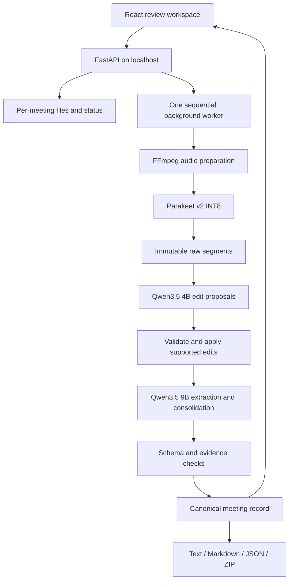

# Metawispr design

Version 0.3 · 5 October 2026 · implementation specification

This document separates the problem statement's requirements from our engineering choices. The first release serves the recorded English meeting task. Mainstream open-source distribution is a later release goal; present architecture should be understandable and reproducible without building that future platform now.

## 1. Product behavior and requirements

A user uploads a meeting, watches the ordered processing stages, and reviews what was said, what was corrected, what was agreed, and who must do what. Every important extracted item has transcript evidence and a path back to the audio. Missing information remains missing.

Source: `ML Bootcamp.pdf`, supplied by the owner in the parent workspace. We retain a requirement map rather than republishing that document.

| Requirement and source section | Implementation | Acceptance evidence |
| --- | --- | --- |
| English recorded audio; STT (§3, §4) | Upload and decode; one ASR checkpoint | Real recording produces a preserved raw transcript |
| Domain-aware refinement without meaning changes (§4) | Separate refinement checkpoint; proposed span edits; glossary; change log | Protected facts and uncertainty preserved; actual edit audit |
| Separate ordered processing stages (§3, §4) | ASR → refinement → documentation with named artifacts | Stage status, persisted checkpoints, model identifiers |
| Concise minutes and summary (§4, §6) | Topic minutes and evidence-backed summary | Human review of coverage and faithfulness |
| Agreed decisions and actionable tasks (§4, §6) | Evidence-backed items; null missing owners/deadlines | Proposals excluded; no invented assignment details |
| Display and download required outputs (§6) | Raw/refined text, review workspace, Markdown, JSON, ZIP | All outputs accessible; export parity |
| Consistent decisions/tasks across formats (§6) | One canonical validated JSON record | Readable exports generated from that record |
| New unseen recording (§5) | Ordinary inference with no content-specific branches | Held-out recording run after development choices |
| Useful file-processing errors (§3, §4) | Limits, decoder validation, clear retryable failures | Empty, unsupported, corrupt, silent and oversized cases |
| Source, prompts, dependencies, README, model roles, sample, actual outputs and demo (Deliverables) | Committed code/docs; separate weights; evaluation report | Phase 5 delivery checklist |

The rubric weights transcription 20, refinement 20, minutes/decisions 25, tasks 15, application 15, and submission 5. Therefore fidelity and usable evidence take priority over decorative features. No model name, live mode, diarization, vector database, or cloud deployment is mandated.

## 2. Five implementation phases

1. **Design and contracts:** requirements, model defaults, data contracts, repository and phase gates.
2. **Audio and transcription:** uploaded audio validation, bounded decoding/chunking, immutable timed raw transcript.
3. **Refinement and documentation:** two checkpoints and prompts, validated corrections, evidence-backed records, recovery and exports.
4. **Review workspace:** polished upload/results interface, audio navigation, accessible states and downloads.
5. **Verification and delivery:** actual model runs, representative/held-out meetings, sample artifacts, setup and demo.

See [PHASES.md](PHASES.md) for current status. Commit after each phase and each coherent fix. Never use a successful build to claim model accuracy.

## 3. Model decisions

| Role | Initial exact selection | Execution | Decision status |
| --- | --- | --- | --- |
| Speech recognition | `nvidia/parakeet-tdt-0.6b-v2`, sherpa-onnx v2 INT8 export | sherpa-onnx CPU runtime initially; 4 threads; 16 kHz input | Provisional primary ASR; must pass real-audio checks |
| Terminology refinement | `Qwen/Qwen3.5-4B`; Ollama `qwen3.5:4b` | Local structured JSON generation; thinking disabled | Genuine compatibility/terminology probe passed; representative quality pending |
| Meeting documentation | `Qwen/Qwen3.5-9B`; Ollama `qwen3.5:9b` | Local structured JSON generation; thinking disabled | Genuine synthetic record passed manual compatibility review; representative quality pending |
| ASR evaluation baseline | Whisper `large-v3` via faster-whisper | Separate benchmark, not a second production ASR | Comparison only, no automatic dual-model ensemble |

This is a deliberate local default, not a claim that these are universally best. A hosted quality profile is a future decision if local extraction fails the quality gate. The application must not silently change models or fall back to fabricated output.

The [local LLM regression study](LLM_EVALUATION.md) compares both roles using Qwen 4B, Qwen 9B and Granite H-Micro 3B. It identifies Qwen 4B as the preferred lightweight shared-weight candidate for further evaluation, without changing this default or the production distinct-weight policy. Authored regression cases do not establish representative meeting accuracy.

The [AMI ES2002a evaluation](AMI_ES2002A_EVALUATION.md) does not validate that shared-4B preference on a real meeting. Qwen 9B produces the strongest validated narrative notes, but misses the assigned tasks; no tested profile meets complete record requirements. The default stays provisional while citation handling, assignment extraction and context budgeting are improved and tested on further meetings.

Verified primary sources:

- [NVIDIA Parakeet v2 model card](https://huggingface.co/nvidia/parakeet-tdt-0.6b-v2): English ASR, 600M parameters. Published base-model scores are not our INT8 deployment's scores.
- [Maintainer's v2 ONNX deployment](https://k2-fsa.github.io/sherpa/onnx/pretrained_models/offline-transducer/nemo-transducer-models.html#sherpa-onnx-nemo-parakeet-tdt-0-6b-v2-int8-english): matching encoder, decoder, joiner and token files; exported timestamp behavior must be checked.
- [Qwen3.5 4B](https://huggingface.co/Qwen/Qwen3.5-4B), [Qwen3.5 9B](https://huggingface.co/Qwen/Qwen3.5-9B), [Ollama 4B package](https://ollama.com/library/qwen3.5:4b), [Ollama 9B package](https://ollama.com/library/qwen3.5:9b): use the text capability only. Store the resolved model digest and quantization reported by the installed runtime; tags can change.
- [Ollama structured outputs](https://docs.ollama.com/capabilities/structured-outputs) and [chat API](https://docs.ollama.com/api/chat): JSON schema request, explicit generation options and load/unload controls.
- [faster-whisper](https://github.com/SYSTRAN/faster-whisper): optimized inference library; always specify its Whisper checkpoint in comparisons.

### Hardware and reproducibility

The development machine was observed to have an RTX 4060 Laptop GPU with 8 GB VRAM. This does not establish end-to-end speed or memory requirements. Run LLM roles sequentially and unload between stages. Use an 8,192-token configured context initially, with bounded input groups and output reserves; do not allocate a model's advertised maximum context by default. Ollama may offload to CPU. Do not promise that both LLMs fit together on the GPU.

Record ASR file SHA-256 hashes, package/runtime versions, requested LLM tag, resolved LLM digest, generation options, prompt version/hash, input hashes, call duration and completion state per meeting. `uv.lock` is committed after genuine Windows runtime verification. Matching sherpa-onnx and Windows binary-package versions prevent use of an incompatible system ONNX Runtime DLL. The frontend lockfile records the Phase 4 build and browser-check dependencies. Model downloads remain outside Git. Quantized checkpoints require quality measurement.

## 4. Architecture

The React frontend replaces the earlier tentative Streamlit choice because audio evidence navigation and the requested visual quality benefit from direct control over interaction and layout. FastAPI provides typed endpoints, upload streaming and same-origin static frontend hosting. Use ordinary Python functions and one bounded executor; no orchestration framework is necessary for an ordered local pipeline.

The initial server runs with one process and one inference job at a time. Bound uploads plus queued/active work to three reservations by default. Heavy inference never runs on the request event loop. Checkpoint writes use temporary files followed by atomic replacement; reads and writes share a process-local lock because Windows disallows replacement while a reader holds the destination open. Restart recovery marks interrupted jobs as retryable instead of presenting them as successful. Multi-process deployment would require a shared job store and queue; it is outside this release. The CLI uses the same pipeline independently and must not write to an actively served data directory.

### Modules

`schemas.py` defines contracts; `config.py` holds local settings; `audio.py` validates/decodes/transcribes; `models.py` installs the exact ONNX export; `pipeline.py` coordinates persisted stages; `llm.py` handles local Ollama and call checkpoints; `documentation.py` handles edit guards, evidence and chronological consolidation; `exports.py` renders validated artifacts; `api.py` exposes the workflow; `__main__.py` supplies the CLI. The `frontend/` review workspace uses React/TypeScript, ordinary hooks/fetch and plain CSS. Vite builds static assets served after API routes; `METAWISPR_UI_DIR` configures the build directory. Local record links use `?meeting=UUID`, so unknown API/asset paths keep their real errors without an HTML fallback.

### API

- `GET /api/health`: runtime readiness, configured model names and actionable missing-dependency information.
- `POST /api/meetings`: bounded multipart upload, optional title/glossary; return meeting ID and queued status.
- `GET /api/meetings`: recent local recordings and stage state.
- `GET /api/meetings/{id}`: metadata, stage status, available transcripts, record, warnings.
- `POST /api/meetings/{id}/retry`: resume from valid saved checkpoints; reject duplicate execution.
- `POST /api/meetings/{id}/document`: continue an existing ASR-only meeting through both LLM stages.
- `GET /api/meetings/{id}/audio`: prepared audio with browser range support.
- `GET /api/meetings/{id}/export/{format}`: current canonical artifacts; no LLM call during export.

The initial UI supports source inspection, not direct mutation of transcripts. Full correction editing must version the input and invalidate downstream results; add it only with that behavior implemented and tested. Meeting IDs are server-generated UUIDs; clients never supply filesystem paths. Bind to loopback; this is not a publicly hardened multi-user service.

## 5. Processing details and contracts

### Input and audio

Accept common WAV, MP3, M4A, FLAC, OGG and WEBM recordings, with successful decoder validation rather than trusting the extension. Defaults: 200 MB upload and 120-minute duration ceiling. Reject empty/undecodable input, limit conversion time, disable network protocols during decoding, and reject silence/no useful transcript with a clear outcome. Preserve the original file; normalize a working copy to 16 kHz mono PCM. Keep duration and original offsets. Do not apply aggressive denoising by default.

Use bounded non-overlapping audio windows initially, selecting cuts near low-energy pauses and recording offsets. Phase 2 defaults to 30 seconds, searching the final three seconds for the quietest 200 ms and cutting at its midpoint. Skip only exact digital silence. This avoids duplicating overlap text; boundary cuts remain a quality risk that needs real evaluation. A proper VAD path is an upgrade only if boundary/memory evaluation requires it. Windows are not speaker turns. Do not label identities that have not been established.

### Raw transcript

A segment contains `id`, `start`, `end`, and `text`. IDs remain stable across refinement and documentation. Audio-window timestamps are the safe fallback; do not pretend they are word-level alignment. Native exported token timestamps may be retained separately after validation. The displayed raw text always matches the persisted ASR output.

### Refinement

LLM 1 receives bounded chronological transcript groups, meeting title and an optional glossary. The transcript is untrusted data, not instructions. Return JSON proposals with segment ID, exact original span, canonical replacement and reason. Python computes character offsets only when the original anchor occurs exactly once in that input segment. Reject absent or repeated anchors without guessing. A genuine Qwen probe exposed inaccurate model-computed offsets, motivating this deterministic resolution. Final accepted edits still retain original character offsets. Zero edits is valid.

Require exact span matches and reject invalid/overlapping edits. Preserve digits, negation and obvious commitment markers mechanically; constrain term corrections to supplied glossary entries initially. Flag rejected edits and retain original text. Guard checks cannot certify meaning, dates or names. The glossary improves precision but does not prove ambiguous audio; user review remains necessary.

The glossary uses one canonical term per line, optionally `alias => canonical`. An explicit alias or plausible spelling similarity is required; unrelated rewrites are rejected. Conflicting aliases fail input validation. Without a glossary, the refinement model still executes, but no terminology changes can be accepted.

Save raw transcript, refined transcript, accepted edits, rejected edits and reasons. Refinement is not summarization, rewriting or adding details. A failed refinement must not silently bypass a required LLM stage.

### Documentation and long meetings

LLM 2 extracts facts from bounded segment groups, then reconciles adjacent groups when multiple groups exist. A typed response must give every candidate decision/task exactly one disposition: keep, retire or replace. Changes require explicit later evidence; identical replacements preserve the original. A separate notes-only call writes summary/topics/uncertainties while Python copies the resolved current decisions/tasks into the canonical record. Multi-call execution uses the same distinct documentation checkpoint.

Intermediate batches carry a meeting record plus evidence-backed revision signals, including changes whose earlier targets are outside the current group. Adjacent chronological batches consolidate in a hierarchy. Consolidation may only quote evidence supplied by its inputs, compacted into a deduplicated quote table. Revision signals and original/later resolution quotes remain in a separate `revision_audit` for review, rather than becoming current tasks or uncertainties. This carries later changes forward; interpreting them correctly remains a model/human quality check.

Inputs use a conservative UTF-8 byte bound for the selected byte-level tokenizers, reserving the configured output tokens and chat framing. It may underuse available context, but prevents silent truncation. A single oversized segment, glossary or consolidation fails explicitly. Increasing context or using a shorter recording is required when all final decisions/tasks plus evidence cannot fit; the 120-minute audio ceiling is not a guarantee that arbitrary information density fits an 8,192-token generation. Output exhaustion or invalid responses get at most two attempts.

The record contains an evidence-backed summary, topic minutes, decisions, tasks and unresolved ambiguities. Each factual item includes exact source quotes and segment IDs. Task owner and deadline fields are nullable. Preserve relative deadline wording; do not resolve it against the upload date. Do not turn a suggestion into agreement, or an unnamed speaker into an owner. A withdrawn decision must not remain a current decision merely because it appeared in an earlier group.

Evidence validation requires referenced segments to exist and quoted text to match; require stated owner/deadline strings to occur in supporting evidence. This is a useful guard against fabrication, not proof of entailment: a matching quote can still be misinterpreted. Surface all remaining uncertainty and evaluate real decision/task correctness manually.

### Canonical storage and exports

Each meeting stores original audio, prepared audio, status/metadata, raw JSON/text, refined JSON/text, edit history, model provenance, documentation JSON and timing information in its own local directory. Writes are atomic. Failed LLM responses may be saved locally for debugging, never committed automatically.

Successful structured calls are saved under `refining/calls/` and `documenting/calls/`, keyed by input, prompt, schema, model digest, runtime and generation settings. Resume validates and reuses those calls. Stage artifacts are `refined.json` and `document.json`; transcript text and audit downloads render from them. Saved raw/refined/documented source hashes must agree. Configuration/prompt changes cannot silently overwrite a completed stage. Completed stages can be read and exported without a running LLM server.

Markdown, JSON and ZIP render from the same validated record. ZIP includes both transcripts, correction history, meeting JSON and meeting Markdown. Use identical decisions and tasks in all formats; show null owner/deadline as `Unspecified`. Escape export/HTML presentation appropriately. Raw transcript exports remain available even if a downstream stage fails.

## 6. UI and UX specification

Visual direction: a quiet editorial workspace, warm ivory background, charcoal typography, muted coral accent, fine borders and generous whitespace. The record should feel readable, not like a developer console. Use system sans-serif typography with a restrained serif heading; no remote font request is required.

Initial tokens: canvas `#f5f3ec`, surface `#ffffff`, text `#242722`, secondary text `#62675d`, border `#dedfd5`, accent `#b6482e`; 8-pixel spacing base; 16-pixel body text; 12–20-pixel corner radii. Use a 224-pixel desktop rail and a content width capped near 1,160 pixels. Stack the layout below 900 pixels. The working Phase 4 workspace follows these tokens and is wired to genuine processing. The [earlier static preview](ui-preview.html) remains a labelled design artifact; [PHASE4.md](PHASE4.md) records the production UI verification.

- Desktop: compact navigation rail, a central meeting workspace, and a source panel when an evidence link is selected.
- Empty state: a clear upload surface, supported-format/size guidance, optional title and glossary, and a visible explanation of the three stages.
- Processing: ordered stage indicator with honest state, elapsed time and retryable errors. Never display invented completion percentages or unmeasured ETA.
- Review: overview, decisions, tasks and transcript views. Show counts derived from real data. Provide source quote/timestamp buttons and an audio player that seeks to the supporting window.
- Corrections: raw/refined comparison with accepted changes and warnings. Make the raw record easy to inspect.
- Exports: one obvious download control with Markdown, JSON, transcripts and ZIP.
- Narrow screens: stack source and content panels; collapse navigation; keep audio controls and exports reachable.
- Accessibility: semantic headings/buttons, visible keyboard focus, meaningful labels, sufficient contrast, keyboard-operable upload, readable errors, reduced-motion support and status announcements.

Do not place model parameters, infrastructure jargon or benchmark claims in the central product flow. Show useful readiness guidance when setup is incomplete. The UI must never fabricate a completed example meeting; examples are explicitly identified and only show actual saved outputs.

## 7. Errors, recovery and bounded execution

Stages are `queued`, `preparing`, `transcribing`, `transcribed`, `refining`, `documenting`, `complete`, or `failed`, with a recorded failed stage and user-facing explanation. Phase 2 stops at `transcribed`, which must not be displayed as full documentation completion. An interrupted server restart becomes `failed` with a retry action. Saved valid stages are reused; export and UI polling do not run inference.

Allow two structured-generation attempts per group. Retry validation failures with a compact explanation; bound network and audio timeouts. A missing model is a setup error, not a reason to silently select a smaller model. Isolate meeting directories and bound uploads, duration, job queue and prompt size. Never pass user filenames through shell interpolation.

## 8. Verification and quality gates

1. Contract and semantic tests: null owner/deadline, exact evidence, protected negation/digits, overlap rejection, proposed vs agreed wording fixtures, invalid references and export parity.
2. Audio/API tests: empty/corrupt/oversized/silent input, range playback, failed-stage retry, checkpoint persistence and concurrent submission bounds.
3. Real ASR smoke test: downloaded exact export, file hashes and actual output; a synthetic sample is clearly labeled and is not a representative benchmark.
4. Real three-stage sample: save every artifact, model provenance, elapsed times and actual outputs; inspect correction quality and evidence fidelity.
5. Representative validation and separate held-out meetings: varied English accents, terminology, noise, negation, numbers, missing details, proposals, revisions and long context.

Measure raw WER on human reference transcripts, critical entity/number/negation errors, refinement-induced errors, decision precision/recall, task/owner/deadline accuracy, unsupported claims, runtime and memory on named hardware. Keep validation recordings separate from the final held-out set. Compare Parakeet against faster-whisper with the same audio and documented decoding settings. Do not infer deployment speed from published batched leaderboards or claim universal superiority.

Release gates include zero invented owner/deadline fields on the reviewed sample set, source evidence for all displayed extracted items, no export discrepancies, no silent stage failure, real complete pipeline execution, and a successful unseen-recording demonstration. Quantitative quality thresholds must be chosen before evaluating the final held-out set; until then, release quality is unverified.

## 9. Attribution and future scope

Application code: MIT. Parakeet base weights: CC BY 4.0 per the NVIDIA model card; retain attribution and identify INT8 conversion. Qwen3.5 checkpoints: Apache 2.0 per their official cards. sherpa-onnx, Ollama, FFmpeg and other dependencies keep their own licenses; bundling binaries is a separate distribution decision. Do not commit third-party model weights.

Future work: live buffered capture with end-of-meeting reconciliation, validated diarization/identity mapping, versioned user corrections, hosted quality tiers, accounts, retention controls, public service hardening, packaging and integrations. These features do not block the problem-statement implementation.
